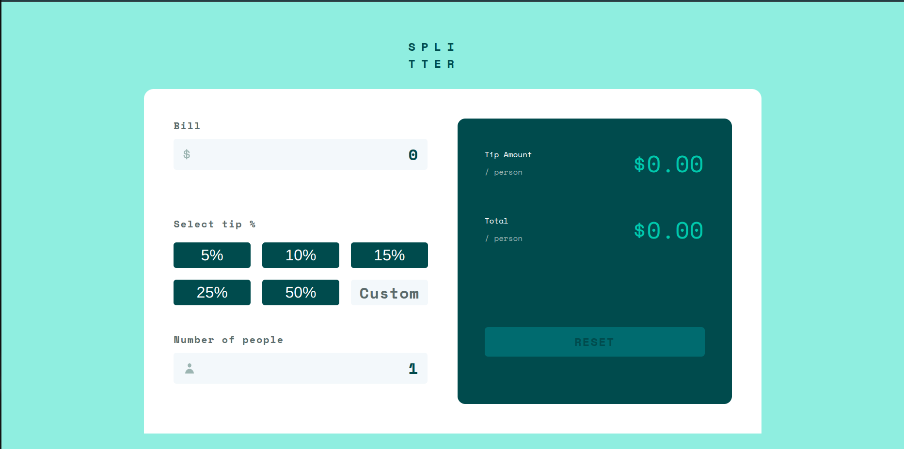
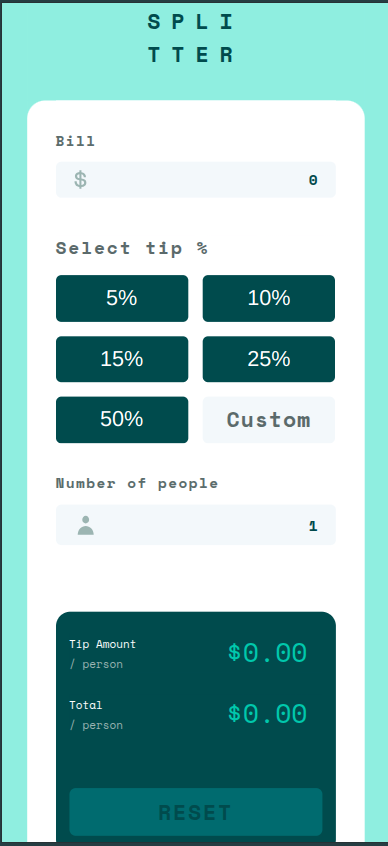

# 💰 Bill Splitter  

A simple, responsive, and intuitive web app to split bills among friends. It calculates the tip per person, total amount per person, and supports both preset and custom tip percentages. Works seamlessly across all screen sizes!  

You can add a section in your README like this:  

### Live Demo 🚀  
Check out the live version of **Bill Splitter** hosted on Vercel:  
👉 [Your Live Link Here](https://splitter-app-weld.vercel.app/)  


## 🚀 Features  
- **Bill Splitting:** Enter the bill amount and number of people  
- **Tip Calculation:** Choose a tip percentage or enter a custom tip  
- **Real-Time Updates:** Instant calculation of tip per person and total amount per person  
- **Fully Responsive:** Optimized for all screen sizes (mobile, tablet, desktop)  
- **Fast & Lightweight:** Built with modern web technologies for high performance  

## 🛠 Tech Stack  
- **Framework:** React  
- **Language:** TypeScript  
- **Styling:** Modular CSS  
- **Bundler:** Vite  

## 🔧 Installation & Setup  
1. **Clone the repository:**  
   ```sh
   git clonehttps://github.com/Vkm1324/Splitter-App
   cd Splitter-App
   ```  
2. **Install dependencies:**  
   ```sh
   pnpm install
   ```  
3. **Run the development server:**  
   ```sh
   npm run dev
   ```  
## 📷 Screenshots  
### Desktop View  
  

### Mobile View  
  
